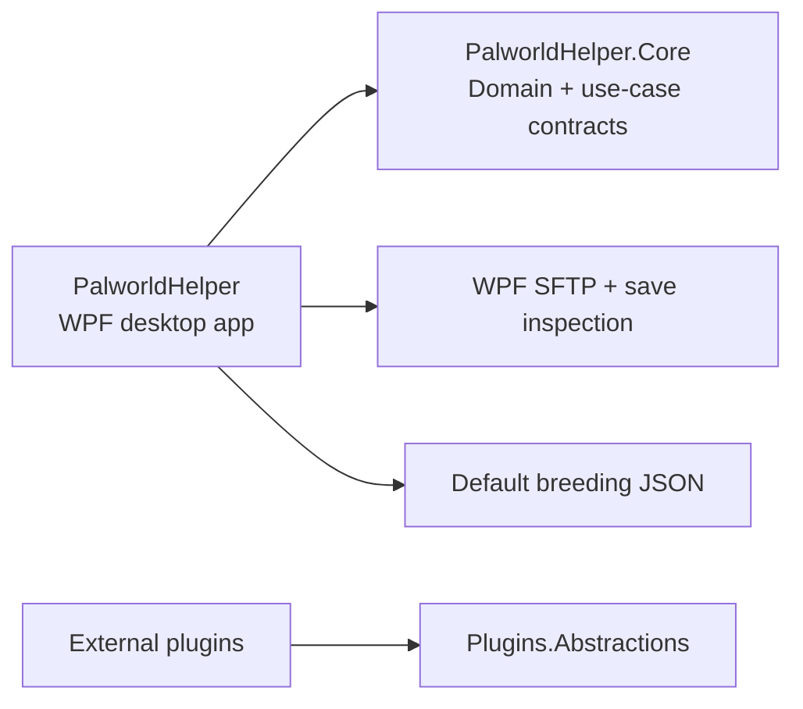

# Architecture

PalworldHelper uses a pragmatic clean architecture.

## Dependency rules

- `Core` depends on no infrastructure project.
- `Data` implements persistence contracts defined by `Core`.
- `SaveImport` implements acquisition and conversion contracts defined by `Core`.
- `PalworldHelper` is the current WPF application and packaging target.
- Plugin contracts remain deliberately small and stable.

## Local-first application model

The executable is a local Windows desktop application. Server credentials and save paths are stored locally; the default breeding dataset is shipped as a normal JSON file next to the executable.

## Data separation

Reference data and user-owned data are distinct concepts:

- Reference data: Pal species, elements, passive skills, and breeding recipes, versioned by game-data release.
- User data: server profiles, players, imported Pal instances, synchronization history, and preferences.

This allows game-data upgrades without replacing the user's collection.

## Evolution

Database schema changes use migrations. Public plugin interfaces are versioned. Large architectural choices receive an ADR.
